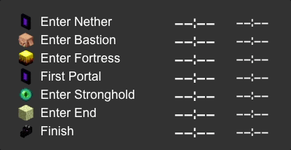

# MCSR (Minecraft Speedrunning) Pace Widget

## About

A Minecraft Speedrun pace widget tool that displays your pace in real time.

## Requirements

- SpeedRunIGT 14.0 or later
  - **Set "Auto Save Interval" (in SpeedRunIGT Option > Timer) to `Ticks` for real-time updates!**

## Features

### Timeline

- Displays your current pace and the difference from your personal best time.

### Visual Timeline (Old name: Indicator)

- A visually intuitive timeline representation.

### Other

- Customizable themes.
- Real-time updates.
- Easily displayed on OBS using a browser source.

## How to Use

### Standalone Execution

1. Download from the [Release Page](https://github.com/mcrtabot/MCSRPaceWidget/releases) and extract the zip file.
2. (Optional) Create a `.config/MCSRPaceWidget` directory within your home directory (Windows: `C:\Users\[username]`, Mac: `/Users/[username]`) and copy the `theme` and `setting` from the extracted directory.
3. Execute `mcsr-pace-widget.jar`.
4. Click `open MCSR Pace Widget` (this will open http://127.0.0.1:1161 in a browser).
5. Select a theme and copy the widget URL.
6. Use the widget (e.g., in the OBS browser source).
7. Set "Auto Save Interval" (in SpeedRunIGT Option > Timer) to `Ticks`.

### Execution as a Jingle Plugin

1. Download from the [Release Page](https://github.com/mcrtabot/MCSRPaceWidget/releases) and extract the zip file.
2. (Mandatory!) Create a `.config/MCSRPaceWidget` directory within your home directory (Windows: `C:\Users\[username]`) and copy the `theme` and `setting` from the extracted directory.
3. Copy `mcsr-pace-widget.jar` to the Jingle plugin directory (`C:\Users\[username]\.config\Jingle\plugins`).
4. Restart Jingle.
5. Open the Plugins -> MCSR Pace Widget tab.
6. Click `open MCSR Pace Widget` (this will open http://127.0.0.1:1161 in a browser).
7. Select a theme and copy the widget URL.
8. Use the widget (e.g., in the OBS browser source).
9. Set "Auto Save Interval" (in SpeedRunIGT Option > Timer) to `Ticks`.

### Settings

- The `setting` directory and `theme` directory are located either within the `.config/MCSRPaceWidget` directory in the home directory or in the same directory as `mcsr-pace-widget.jar`.
- If these directories exist within the `.config/MCSRPaceWidget` directory in the home directory, they will be given priority.

#### PB Time Setting

To see the difference from your personal best (PB), edit the PB Time Setting.

- Click `Pace Settings...` within the MCSRPaceWidget window (or the tab in Jingle) and enter your time.
- Enter the time in the format `12:34` (12m34s) or `12:34.567` (12m34.567s).

#### Custom Theme

- Copy a base theme (e.g., default) and rename it in the `theme` directory.
- Edit the `setting.json` and stylesheets `timeline.css` / `indicator.css`.

## Themes

- Default / Texture-bar

  
  

- Standard

  
  

- Standard-full

  
  

- Paceman (display latest event only)

  
  

- Paceman-list

  
  

- Horizontal

  

- Niwatori

  
  

And your customized themes can be added!

[Minecraft fonts](https://fontmeme.com/jfont/minecraft-font/) can be used for a more Minecraft-like look.
