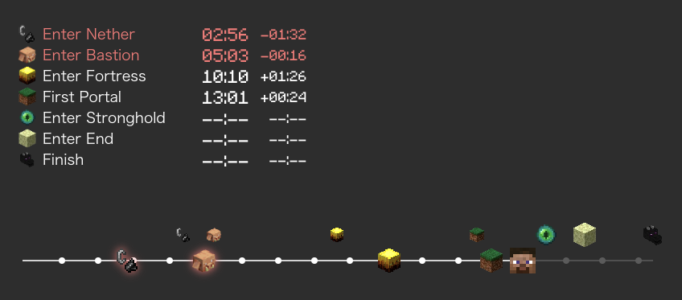
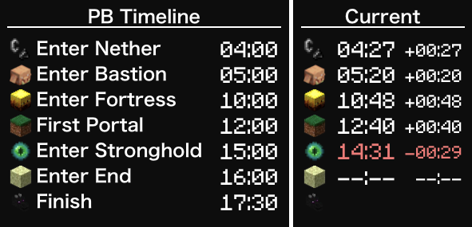
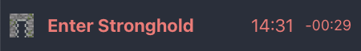
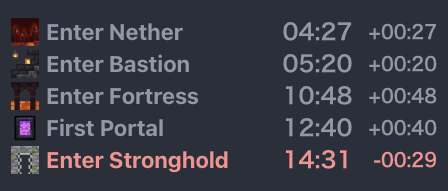

# MCSR (Minecraft Speedruning) Pace Widget

## About

Minecraft Speedrunning pace widget tool that displays your pace in real time.

## Requirement

- SpeedRunIGT 14.0 or later (use event log feature)

## Features

- Display current run pace and time difference from PB.
- Display PB timeline.
- Customizable themes.
- Real-time updates, multi-instance support.
- Easily displayed on OBS by using browser source.

## Themes

- standard (default)

    

- standard-full

    

- paceman (display latest event only)

    

- paceman-list

    

and, your customize themes!

[Minecraft fonts](https://fontmeme.com/jfont/minecraft-font/) can be used for a more Minecraft-like look.

## How to use

### Launch

1. download from [Release Page](https://github.com/mcrtabot/MCSRPaceWidget/releases) and extract zip file.
1. execute `mcsr-pace-widget.jar`
1. select theme from combo box, or default
   - To see a demo of the theme, select the theme and click `open with demo data` link
1. click open button
1. widget will be displayed on browser (http://127.0.0.1:1161)

### Settings

#### PB Time

If you want to see the difference from PB, edit `setting/pb.json`.

- The `type` can be the type of `event.log` output by SpeedrunIGT.
  - (ex `rsg.enter_nether`, use after the dot like `enter_nether`)
- `igt` is the `mm:ss` format of In-game Time

#### Custome Theme

- copy base theme (ex. default) and rename in `theme` directory
- edit `setting.json` and `style.css`
  - You can write any style in `style.css`!
