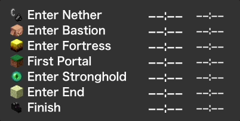
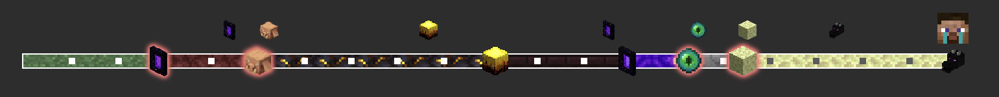
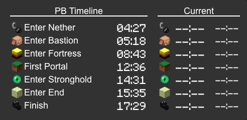
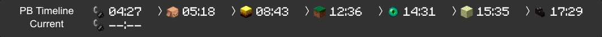

# MCSR (Minecraft Speedruning) Pace Widget

## About

Minecraft Speedrun pace widget tool that displays your pace in real time.

## Requirement

- SpeedRunIGT 14.0 or later (use event log feature)
  - **Set "Auto Save Interval" ( in SpeedRunIGT Option > Timer) to `Ticks` for realtime update!**

## Features

- Display current run pace and time difference from PB.
- Display PB timeline.
- Display time indicator.
- Customizable themes.
- Real-time updates, multi-instance support.
- Easily displayed on OBS by using browser source.

### Timeline

### Indicator

## How to use

1. download from [Release Page](https://github.com/mcrtabot/MCSRPaceWidget/releases) and extract zip file.
2. execute `mcsr-pace-widget.jar`
3. click `open MCSR Pace Widget` (will open http://127.0.0.1:1161 on browser)
4. select theme and copy widget url.
5. use widget (e.g., in the OBS browser source)

### Settings

#### PB Time

If you want to see the difference from PB, edit `setting/pb.json`.

- The `type` can be the type of `event.log` output by SpeedrunIGT.
  - (ex `rsg.enter_nether`, use after the dot like `enter_nether`)
- `igt` is the `12:34` (12m34s) or `12:34.567` (12m34.567s) format of In-game Time

#### Custom Theme

- copy base theme (ex. default) and rename in `theme` directory
- edit `setting.json` and stylecsheet `timeline.css` / `indicator.css`

## Themes

- texture-bar

  

- standard

  
  

- standard-full

  
  

- paceman (display latest event only)

  
  

- paceman-list

  
  

- horizontal

  

- niwatori

  
  

and, your customize themes!

[Minecraft fonts](https://fontmeme.com/jfont/minecraft-font/) can be used for a more Minecraft-like look.
